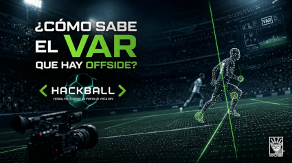

# 01 — ¿Cómo sabe el VAR que hay offside?

> *"La información es más poderosa que la opinión.  
> Pero solo si sabes leerla."*  
> — t474_r0b07
---

---
## La respuesta corta

No lo sabe.

Lo calcula.

Y hay una diferencia enorme entre saber y calcular.

---

## El problema real

El offside parece simple:  
si una parte del cuerpo con la que se puede jugar legalmente el balón está más cerca de la línea de meta que el balón y el penúltimo adversario, en el momento en que un compañero juega o toca el balón, puede existir posición de fuera de juego. La infracción depende además de la participación activa.

Una línea. Dos posiciones. Un instante.

Pero ese instante dura **0.02 segundos**.  
Y en 0.02 segundos, 22 jugadores se están moviendo.  
Y el ojo humano tiene una latencia de respuesta visual de entre **150 y 300 ms**.

Matematicamente, el árbitro de línea ya perdió antes de levantar el banderín.

No es culpa suya. Es física.

---

## El sistema

Lo que FIFA llama **SAOT** — *Semi-Automated Offside Technology* — no es un solo sistema.  
Es un pipeline. Una cadena de herramientas encadenadas donde el output de una es el input de la siguiente.

Así:

```
[CÁMARAS DEDICADAS]
       ↓
[TRACKING DE JUGADORES]
       ↓
[POSE ESTIMATION — 29 keypoints]
       ↓
[SENSOR IMU — balón]
       ↓
[DETECCIÓN DE KICK POINT]
       ↓
[CÁLCULO DE LÍNEA DE OFFSIDE]
       ↓
[ALERTA AUTOMÁTICA → VAR]
       ↓
[ANIMACIÓN 3D → árbitro]
```

Cada eslabón importa. Si uno falla, el sistema falla.

---

## Capa 1 — Las cámaras

En Qatar 2022, FIFA describió una configuración de **12 cámaras dedicadas** bajo la cubierta de cada estadio.  
No eran las cámaras de transmisión: se utilizaban para el seguimiento de jugadores.

Estas cámaras capturan a **50 frames por segundo** — es decir, una imagen cada 20 milisegundos.

La frecuencia de captura documentada para ese sistema fue de 50 fps. No conviene atribuir esa elección a una razón concreta de coste o latencia sin una explicación técnica publicada por FIFA.

> En la Euro 2024 y sistemas Tracab certificados por FIFA, esto escala a **10 cámaras especializadas** con modelos de seguimiento más eficientes. El número varía — el principio no.

---

## Capa 2 — El tracking

Con las imágenes de 12 ángulos distintos, el sistema reconstruye posiciones en **3D**.

El proceso técnico base es **triangulación estereoscópica**:  
dos cámaras desde ángulos distintos ven el mismo punto.  
Con la geometría conocida de las cámaras (posición, FOV, distorsión de lente), se calcula la posición real en el espacio tridimensional.

Esto no es nuevo — es la misma técnica que usan sistemas como **Hawk-Eye** en tenis y cricket, en producción desde los 2000.  
FIFA lo adaptó para tracking multiobjetivo continuo: no un objeto, sino 22 jugadores más el balón, simultáneamente, durante 90 minutos.

---

## Capa 3 — Pose Estimation: los 29 puntos

Aquí está el núcleo del sistema.

El SAOT de FIFA no solo trackea *dónde está* cada jugador.  
Trackea **qué parte de su cuerpo** está en cada posición.

Eso se llama **pose estimation** — estimación de pose corporal.

FIFA describe el seguimiento de **29 puntos de datos** del cuerpo por jugador. La documentación pública no permite asumir que la arquitectura interna sea idéntica a un modelo académico concreto de pose estimation:
- hombros
- codos
- muñecas
- caderas
- rodillas
- tobillos
- pies
- cabeza
- torso

¿Por qué importa esto?  
Porque el reglamento dice que el offside se mide por **la parte del cuerpo más adelantada con la que el jugador puede marcar gol**.  
No por el centro del cuerpo. No por los pies. Por el punto más avanzado relevante.

Un hombro puede estar en offside aunque los pies estén bien posicionados.

Para detectar eso, necesitas saber la posición exacta de cada extremidad.

### ¿Cómo funciona pose estimation?

Las implementaciones públicas más conocidas son **OpenPose** (Carnegie Mellon University, 2017) y **MediaPipe** (Google, 2019).

**OpenPose** usa un enfoque *bottom-up*:
1. Una red convolucional (CNN) basada en VGG-19 procesa el frame completo
2. Genera **confidence maps** — mapas de probabilidad de dónde está cada keypoint
3. Genera **Part Affinity Fields (PAFs)** — campos vectoriales que indican cómo conectar keypoints de la misma persona
4. Un algoritmo de matching construye el esqueleto completo

```python
# Ejemplo simplificado del concepto de confidence map
# Para cada keypoint k en cada pixel (x, y):
# confidence_map[k][x][y] = P(keypoint k está en posición (x,y))

# El sistema busca el peak de cada mapa:
keypoint_position = argmax(confidence_map[k])

# Part Affinity Fields conectan keypoints del mismo cuerpo:
# PAF[x][y] = vector unitario en dirección del miembro corporal
```

**MediaPipe** usa un enfoque *top-down*:
1. Primero detecta la persona completa en el frame (bounding box)
2. Luego estima los keypoints dentro de ese bounding box
3. Más eficiente en tiempo real, más preciso cuando hay oclusiones parciales

FIFA no publica el código ni todos los detalles de implementación. OpenPose y MediaPipe sirven aquí como referencias didácticas de pose estimation; no hay base para afirmar que SAOT use esas arquitecturas o que sus puntos sean directamente comparables.

La diferencia entre los conjuntos de puntos de distintos modelos no debe interpretarse como una mejora directa de precisión: las definiciones y los objetivos de cada sistema pueden ser distintos.

---

## Capa 4 — El sensor del balón

Las cámaras resuelven la posición de los jugadores.  
Pero queda otro problema: **¿cuándo exactamente salió el pase?**

El offside se mide en el momento del contacto con el balón — no cuando el delantero recibe, sino cuando el pasador toca.

Ese momento se llama **kick point**.

Para detectarlo con precisión milimétrica, el balón oficial (Adidas Al Rihla en Qatar 2022, Fussballliebe en Euro 2024) lleva embebida una **IMU** — *Inertial Measurement Unit* — una unidad de medición inercial.

La IMU contiene:
- **Acelerómetro** de 3 ejes — mide aceleración lineal
- **Giroscopio** de 3 ejes — mide velocidad angular
- **A veces magnetómetro** — orientación respecto al campo magnético terrestre

Esta combinación de sensores se llama **sistema IMU 6-DOF** (6 degrees of freedom) o **9-DOF** si incluye magnetómetro.

Según la descripción del sistema empleado en Qatar 2022, el sensor transmitía datos a **500 Hz**. La frecuencia concreta corresponde a esa configuración, no necesariamente a todos los balones o torneos.

Cuando el balón recibe un impacto, la IMU detecta un pico brusco de aceleración:

```
Señal acelerómetro (eje Z) durante un pase:

valor
  |
  |              ▲ IMPACTO (~150g de aceleración)
  |             /|\
  |            / | \
  |___________/  |  \___________
  |
  +---------------------------------> tiempo
                 ↑
            kick point
            (t = 0.002s de incertidumbre)
```

Ese pico, combinado con la posición del balón, ayuda a identificar el instante de contacto. La cifra de incertidumbre espacial inferior a 3 cm no queda suficientemente respaldada por las referencias enlazadas aquí, por lo que no la presento como especificación verificada.

---

## Capa 5 — El cálculo final

Con todo el pipeline activo, el sistema tiene en cada instante:

```python
# Datos disponibles en t = kick_point:
jugadores = {
    'delantero_9': {
        'keypoints': {
            'hombro_izq': (x=52.3, y=34.1, z=1.4),  # metros en el campo
            'hombro_der': (x=52.8, y=34.1, z=1.4),
            'pie_der':    (x=51.9, y=34.0, z=0.1),
            # ... 26 keypoints más
        },
        'punto_mas_adelantado': (x=52.8, y=34.1)  # hombro derecho
    },
    'defensor_4': {
        'punto_relevante': (x=51.1, y=34.2)  # segundo último defensor
    }
}

# La línea de offside es la posición X del segundo último defensor
linea_offside = jugadores['defensor_4']['punto_relevante']['x']  # 51.1m

# ¿Está el delantero en offside?
punto_adelantado = jugadores['delantero_9']['punto_mas_adelantado']['x']  # 52.8m

offside = punto_adelantado > linea_offside
# offside = 52.8 > 51.1 = True
# Diferencia: 1.7 metros. Caso claro.

# En casos límite, el margen puede ser pequeño.
# La cifra de 3 cm no se presenta aquí como precisión certificada del sistema.
```

Cuando el sistema detecta offside, genera automáticamente:
1. Una **alerta** para el VAR
2. Una **animación 3D** con los datos exactos — visible en pantallas del estadio

FIFA y otras comunicaciones institucionales han destacado una reducción del tiempo de revisión con SAOT. No mantengo aquí la comparación exacta de 70 a 23 segundos porque la referencia enlazada no permite verificar que sea una media comparable y generalizable.

---

## Lo que el sistema no resuelve

Todo lo anterior funciona para offside **posicional** — dónde están los cuerpos.

Pero el offside también tiene componente **subjetiva**:

- ¿El delantero estaba interfiriendo con el portero aunque no tocara el balón?
- ¿La posición en offside afectó la jugada aunque no hubiera contacto?

Esas preguntas no las responde ningún algoritmo.  
Las responde el árbitro.

Y ahí — exactamente ahí — está el límite entre lo que puede automatizarse y lo que no.

Un sistema puede estimar posiciones con gran precisión, dentro de los límites de sus sensores y modelos.  
No puede resolver por sí solo todas las cuestiones de **participación e interferencia** que exige el reglamento.

---

## La pregunta que queda abierta

Si el sistema puede estimar la posición de cada extremidad de cada jugador, en tiempo real y con suficiente precisión para asistir al árbitro...

¿Cuánto tiempo falta para que el propio sistema tome la decisión final sin intervención humana?

Y si ese día llega — ¿qué rol queda para el árbitro?

> `// hay sistemas que empiezan como soporte y terminan como reemplazos.`  
> `// el que quiere entender, que entienda.`

---

## Challenge embebido

```
El sistema SAOT procesa datos del balón a 500 Hz.
Las cámaras de tracking operan a 50 fps.

En una ventana de 20 milisegundos, suponiendo una captura constante de 500 Hz,
el sensor IMU enviaría N lecturas.

¿Cuánto es N?

Respuesta → issues del repo, título: [HACKBALL-01]
El primer flag correcto se lleva crédito en el README.
```

---

<details>
<summary><code>// referencias técnicas</code></summary>

- FIFA SAOT — [inside.fifa.com/innovation/world-cup-2022/semi-automated-offside-technology](https://inside.fifa.com/innovation/world-cup-2022/semi-automated-offside-technology)
- Tracab SAOT FIFA Certified — [sportsvideo.org](https://www.sportsvideo.org/2024/06/17/tracab-semi-automated-offside-technology-awarded-fifa-certification/)
- OpenPose — Carnegie Mellon University, Cao et al., 2017
- MediaPipe Pose — Google Research, 2019
- Offside Detection RIT — [arxiv.org/abs/2502.16030](https://arxiv.org/abs/2502.16030)
- UEFA EURO 2024 Technology — [uefa.com](https://www.uefa.com/news-media/news/028d-1ada99d5c45d-aa9eb88fcf73-1000--football-technologies-at-uefa-euro-2024/)

</details>

---

<details>
<summary><code>// lore relacionado</code></summary>

El concepto de **Part Affinity Fields** — la técnica que usa OpenPose para conectar keypoints — fue publicado por Zhe Cao, Tomas Simon, Shih-En Wei y Yaser Sheikh en CVPR 2017.

El paper original se llama *"Realtime Multi-Person 2D Pose Estimation using Part Affinity Fields"*.  
Está disponible en arXiv: 1611.08050.

Antes de que FIFA lo usara para detectar offsides, la misma técnica se usaba para analizar movimiento en cirugía robótica y captura de movimiento en producción de cine.

La tecnología no nació para el fútbol.  
El fútbol la adoptó cuando maduró lo suficiente.

Así funciona casi siempre.

</details>

---

*← [índice](../../README.md) · siguiente → [02 — El balón también tiene sensores](02_balon_sensores.md)*

---

> *t474_r0b07 · [github.com/t474-r0b07](https://github.com/t474-r0b07)*  
> `// construyo sistemas pensando en cómo romperlos.`
