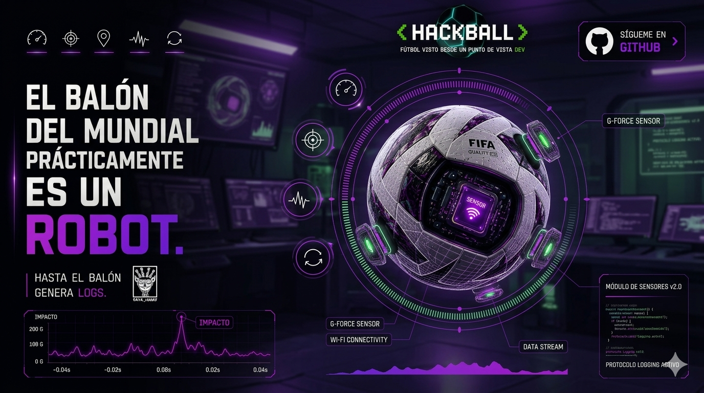

# 02 — El balón también tiene sensores

> *"No confundas lo que ves con lo que hay.  
> El balón que pateas también te está mirando."*  
> — t474_r0b07
---

---

## // ya sé lo que estás pensando.

```
"pero si el jugador ya estaba en offside antes del pase..."
```

Exacto.

Y eso es precisamente el problema que resuelve este post.

El sistema del post anterior sabe dónde están los 22 jugadores en cada fracción de segundo.  
Pero el offside no se mide en cualquier momento.  
Se mide en **un instante específico**: cuando el balón sale del pie del pasador.

No cuando llega. No cuando el delantero lo recibe.  
Cuando *sale*.

Y ese instante dura **2 milisegundos**.

Para detectarlo, el balón necesita hablar.

---

## El hardware

El balón oficial del Mundial Qatar 2022 — **Adidas Al Rihla** — llevaba embebido un sistema desarrollado por **KINEXON**, empresa alemana especializada en sensor networks y edge computing.

El sensor pesa **14 gramos**.  
El balón pesa entre 410 y 450 gramos según reglamento FIFA.  
Diferencia de peso: menos del 3%.  
Efecto en el rendimiento del balón: no medible.

Adidas desarrolló un sistema de suspensión propio — el **Adidas Suspension System** — para mantener el sensor estabilizado en el centro geométrico del balón durante impactos, rotaciones y vuelo.

¿Por qué el centro exacto?  
Porque si el sensor está descentrado, las lecturas de rotación se contaminan.  
Un giroscopio fuera del eje de rotación mide fuerza centrífuga además de velocidad angular — y eso introduce error en los cálculos.

El sensor se carga por **inducción** — sin cables, sin contacto físico.  
Batería: **6 horas de uso activo** por carga.  
Un partido dura 90 minutos + descanso + tiempo añadido. Entra cómodo.

---

## Dos sensores, dos funciones

El sistema KINEXON no es un solo sensor. Son **dos tecnologías combinadas**:

```
┌─────────────────────────────────────────────────────┐
│                  SENSOR KINEXON                      │
│                                                      │
│   ┌─────────────────┐    ┌──────────────────────┐   │
│   │      IMU         │    │        UWB            │   │
│   │                 │    │                      │   │
│   │  Acelerómetro   │    │  Ultra-Wideband      │   │
│   │  Giroscopio     │    │  Radio Frequency     │   │
│   │  (opcional:     │    │                      │   │
│   │  Magnetómetro)  │    │  Posición absoluta   │   │
│   │                 │    │  en el campo         │   │
│   │  Movimiento     │    │                      │   │
│   │  relativo       │    │  Precisión: cm       │   │
│   │                 │    │  Latencia: <20 μs    │   │
│   │  500 Hz         │    │                      │   │
│   └─────────────────┘    └──────────────────────┘   │
└─────────────────────────────────────────────────────┘
```

Funcionan juntos porque resuelven problemas distintos.

---

## IMU — el detector de impacto

**IMU** = *Inertial Measurement Unit*.

Mide movimiento **relativo** — no sabe dónde está en el campo, pero sabe exactamente qué está haciendo el balón en cada instante.

Componentes:

**Acelerómetro** — mide aceleración lineal en 3 ejes (X, Y, Z).  
Cuando el pie contacta el balón, la aceleración pasa de ~0 a valores de entre **50g y 150g** dependiendo de la potencia del disparo.  
Ese pico es inconfundible. Es el **kick point**.

**Giroscopio** — mide velocidad angular en 3 ejes.  
Detecta rotación del balón — spin, efecto, trayectoria curva.  
Un balón con efecto puede girar a más de **600 rpm**.

La combinación de ambos se llama sistema **IMU 6-DOF** — 6 Degrees of Freedom:
- 3 ejes de traslación (acelerómetro)
- 3 ejes de rotación (giroscopio)

```python
# Señal IMU durante un pase (valores simplificados)

tiempo_ms = [0, 2, 4, 6, 8, 10, 12, 14, 16, 18, 20]
accel_z   = [0, 0, 0, 0, 148, 142, 61, 12, 3, 1, 0]  # en g

# El pico en t=8ms es el kick point
# Duración del contacto pie-balón: ~8-12 ms en un disparo fuerte
# El sistema lo detecta en tiempo real a 500 Hz

kick_point_index = accel_z.index(max(accel_z))
kick_point_ms = tiempo_ms[kick_point_index]

print(f"Kick point detectado en: t = {kick_point_ms}ms")
# Output: Kick point detectado en: t = 8ms
```

A 500 Hz, el sistema captura una muestra cada **2 milisegundos**.  
Incertidumbre en la detección del kick point: **±2ms**.  
En ese tiempo, un balón viajando a 100 km/h recorre aproximadamente **5.5 cm**.

Eso es el margen de error del sistema.  
5 centímetros en un disparo a máxima potencia.

---

## UWB — el GPS de precisión centimétrica

El IMU resuelve *cuándo* ocurre el contacto.  
El **UWB** (*Ultra-Wideband*) resuelve *dónde* está el balón en ese instante.

GPS convencional tiene una precisión de **3 a 5 metros**.  
Para saber si un balón cruzó la línea de gol por 2 centímetros, eso no sirve.

UWB opera en un rango de frecuencia muy amplio — entre 3.1 y 10.6 GHz — con pulsos de muy corta duración.  
La clave está en cómo mide distancia: **Time of Flight (ToF)**.

```
ANCHOR 1 ────────────────────────── BALÓN
         ← señal UWB: 2.14 ns →

distancia = velocidad_luz × tiempo_vuelo
distancia = (3×10⁸ m/s) × (2.14×10⁻⁹ s)
distancia = 0.642 metros
```

Con múltiples anchors alrededor del campo, el sistema triangula la posición exacta del balón en 3D.  
KINEXON instala entre **12 y 24 antenas** (anchors) por estadio.

```
        ANCHOR_A          ANCHOR_B
           ●                 ●
           |  \           /  |
           |    \       /    |
           |      \ ● /      |    ← BALÓN
           |      / ● \      |
           |    /       \    |
           |  /           \  |
           ●                 ●
        ANCHOR_D          ANCHOR_C

Posición calculada = intersección de esferas de distancia
Latencia del cálculo: <20 microsegundos
Precisión: centimétrica
```

La latencia de **menos de 20 microsegundos** es lo que hace al sistema viable en tiempo real.  
Para comparar: el parpadeo humano dura entre 100,000 y 400,000 microsegundos.  
El sistema procesa y ubica el balón **5,000 veces** en lo que tú parpadeás.

---

## La fusión de datos

IMU + UWB por separado son útiles.  
Juntos son el sistema.

```
┌──────────────────────────────────────────────────────┐
│                    PIPELINE COMPLETO                  │
│                                                       │
│  IMU (500 Hz)          UWB (LPS)                     │
│  ┌──────────┐          ┌──────────┐                  │
│  │ Detecta  │          │ Ubica el │                  │
│  │ kick     │    +     │ balón en │                  │
│  │ point    │          │ el campo │                  │
│  └────┬─────┘          └────┬─────┘                  │
│       │                     │                        │
│       └──────────┬──────────┘                        │
│                  ↓                                    │
│         FUSION ENGINE                                 │
│                  ↓                                    │
│   "En t=08ms el balón estaba en (x=34.2, y=51.7)"   │
│                  ↓                                    │
│         → SAOT: comparar con posición                 │
│           de jugadores en ese instante exacto         │
└──────────────────────────────────────────────────────┘
```

Este proceso de combinar datos de múltiples sensores se llama **sensor fusion**.  
Es el mismo principio que usa tu teléfono para combinar GPS + acelerómetro + giroscopio + brújula para saber exactamente dónde estás y en qué dirección miras.

La diferencia es que tu teléfono tiene ~10ms de latencia aceptable.  
Este sistema necesita menos de 0.02ms para ser útil en decisiones de offside.

---

## Lo que genera el balón en 90 minutos

Un partido de 90 minutos a 500 Hz significa:

```python
frecuencia_hz = 500        # muestras por segundo
duracion_s    = 90 * 60    # 5,400 segundos
muestras      = frecuencia_hz * duracion_s

print(f"Muestras totales por partido: {muestras:,}")
# Output: Muestras totales por partido: 2,700,000

# Cada muestra contiene:
# - timestamp
# - aceleración (x, y, z)
# - velocidad angular (x, y, z)
# - posición UWB (x, y, z)
# = ~9 valores por muestra

valores_totales = muestras * 9
print(f"Valores de datos generados: {valores_totales:,}")
# Output: Valores de datos generados: 24,300,000
```

**24 millones de puntos de datos** por partido.  
Solo del balón.

Y eso no incluye los datos de los 22 jugadores.  
Ni los de las 12 cámaras de tracking.  
Ni el audio del árbitro.  
Ni las cámaras de transmisión.

Un estadio moderno durante un partido genera más datos que la mayoría de sistemas empresariales en una semana.

> `// hasta el balón genera logs.`  
> `// y los logs siempre cuentan la verdad.`

---

## El dato que nadie menciona

Toda esa data — **es propiedad de FIFA**.

El comunicado oficial de Adidas sobre el Al Rihla lo dice explícitamente:  
los datos capturados durante el Mundial 2022 son propiedad exclusiva de FIFA.

No de los equipos.  
No de los jugadores.  
No de Adidas.  
No de KINEXON.

**De FIFA.**

Lo que eso significa para el futuro del análisis táctico, la negociación de contratos, el scouting y la inteligencia competitiva en el fútbol profesional...

es otra conversación.

Pero ya sabes que esa conversación existe.

---

## Challenge embebido

```
El sensor IMU opera a 500 Hz.
El sistema UWB tiene una latencia de <20 microsegundos.

Pregunta:
En un disparo a 108 km/h (velocidad promedio de un penalti profesional),
¿cuántos centímetros recorre el balón entre dos muestras consecutivas del IMU?

Respuesta → issues del repo, título: [HACKBALL-02]
Muestra el cálculo. El resultado sin proceso no cuenta.
```

---

<details>
<summary><code>// referencias técnicas</code></summary>

- KINEXON Ball Tracking — [kinexon-sports.com/products/xball](https://kinexon-sports.com/products/xball/)
- Adidas Al Rihla Connected Ball — [news.adidas.com](https://news.adidas.com/football/adidas-reveals-the-first-fifa-world-cup--official-match-ball-featuring-connected-ball-technology/s/cccb7187-a67c-4166-b57d-2b28f1d36fa0)
- KINEXON UWB Technology — [kinexon.com/technology/player-tracking](https://kinexon.com/technology/player-tracking/index.html)
- UWB Time of Flight fundamentals — IEEE 802.15.4a standard
- IMU sensor fusion — Mahony filter, Madgwick filter (open source implementations)

</details>

---

<details>
<summary><code>// lore relacionado</code></summary>

**Ultra-Wideband no es tecnología nueva.**

La FCC autorizó su uso comercial en 2002. La tecnología base existe desde los años 60 — originalmente desarrollada por el Departamento de Defensa de Estados Unidos para comunicaciones de baja probabilidad de intercepción.

Un sistema diseñado para que **nadie pudiera escucharlo** ahora se usa para que **nadie pueda disputar** si el balón cruzó la línea.

La misma tecnología que sirvió para esconder comunicaciones militares ahora decide offsides en mundiales.

El contexto siempre cambia.  
La física no.

</details>

---

*← [01 — ¿Cómo sabe el VAR que hay offside?](01_var_offside.md) · siguiente → [03 — La cámara voladora no está volando](03_camara_cable.md)*

---

> *t474_r0b07 · [github.com/t474-r0b07](https://github.com/t474-r0b07)*  
> `// construyo sistemas pensando en cómo romperlos.`
