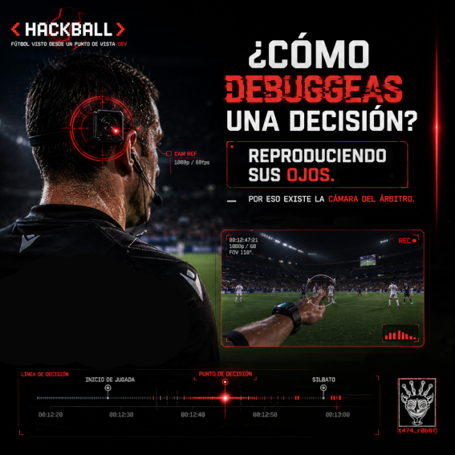

# 04 — La cámara del árbitro

> *"No basta con saber qué pasó.*  
> *Necesitas saber qué estaba viendo quien decidió."*  
> — t474_r0b07
---

---

Ya sé lo que estás pensando.

"¿Para qué poner una cámara en el árbitro si ya hay 20 cámaras en el estadio?"

Esa pregunta tiene una respuesta que cambia cómo piensas sobre evidencia.

---

## El problema que nadie veía

Imagina un incidente.  
Tienes 20 cámaras. Tienes logs. Tienes timestamps.  
Sabes exactamente qué pasó, cuándo pasó y dónde pasó.

Pero el árbitro tomó una decisión que no coincide con lo que muestran esas cámaras.

¿Qué le falta a tu investigación?

**Su perspectiva.**

No lo que pasó.  
Lo que *él vio* cuando decidió.

Eso es lo que la cámara del árbitro resuelve.  
Y es exactamente el mismo problema que resuelve el análisis forense digital.

---

## Cómo funciona

La cámara va montada en el **oído derecho** del árbitro — no en el pecho.

FIFA probó varias posiciones. Cámara de pecho, cámara en el hombro, cámara en la cabeza.  
El oído ganó por una razón técnica específica:

Cuando el árbitro gira la cabeza para seguir la jugada, la cámara gira con él.  
Una cámara de pecho apunta siempre al frente — no captura hacia dónde está mirando realmente.

```
CÁMARA DE PECHO:              CÁMARA EN OÍDO:

árbitro mira derecha →        árbitro mira derecha →
cámara sigue apuntando        cámara apunta a la derecha
al frente                     ✓ captura lo que ve

árbitro mira izquierda →      árbitro mira izquierda →
cámara sigue apuntando        cámara apunta a la izquierda
al frente                     ✓ captura lo que ve
```

El hardware: una cámara miniaturizada en un molde de oído personalizado.  
Dos cables — uno de video, uno de micrófono — van al cuello del uniforme.  
Un transmisor llamado **ballpack** va en el bolsillo del pantalón.

Resolución: **1080p / 60fps**.  
Transmisión: en tiempo real a la sala VAR y a la producción del broadcast.

Debutó oficialmente en el **FIFA Club World Cup 2025**.  
Pierluigi Collina, jefe del comité de árbitros de FIFA: *"superó todas nuestras expectativas."*

---

## La restricción que nadie publicitó

Aquí está el dato que FIFA no puso en el comunicado principal.

El video de la cámara del árbitro se transmite en vivo — pero con un filtro.

> *"El video se emitirá al espectador solo si la acción no es controvertida."*  
> — Al Jazeera, cobertura Club World Cup 2025

Tradúcelo:

Si hay una jugada disputada — un penalti dudoso, una expulsión polémica, un gol anulado —  
**la cámara se corta.**

El broadcast no muestra la perspectiva del árbitro exactamente cuando más la necesitas.

¿Por qué?

Porque mostrar en tiempo real lo que vio el árbitro en una decisión polémica  
crea un problema legal y de relaciones públicas que FIFA no quiere manejar en vivo.

La cámara existe para transparencia.  
Pero transparencia selectiva.

> `// los sistemas de auditoría casi siempre tienen excepciones.`  
> `// las excepciones casi siempre protegen a quien diseñó el sistema.`

---

## El paralelo forense

En investigación digital existe un principio fundamental:

**No basta con reconstruir los eventos. Hay que reconstruir el estado del sistema en el momento del evento.**

```
INVESTIGACIÓN ESTÁNDAR:
[evento] → ¿qué pasó?

INVESTIGACIÓN FORENSE COMPLETA:
[evento] → ¿qué pasó?
          + ¿qué datos tenía disponibles el actor?
          + ¿qué veía en ese instante exacto?
          + ¿qué información le faltaba?
```

La diferencia entre las dos columnas es la diferencia entre saber que alguien tomó una decisión  
y entender **por qué** era razonable tomarla con la información disponible en ese momento.

En ciberseguridad lo llaman **perspectiva del atacante**.  
En forense lo llaman **reconstrucción del estado del sistema**.  
En fútbol lo llaman **cámara del árbitro**.

Es el mismo problema. Tres nombres distintos.

---

## Lo que esto cambia en entrenamiento

Collina mencionó el segundo uso — el que importa más a largo plazo:

**Coaching de árbitros.**

Antes, el análisis postpartido de un árbitro se hacía con las mismas cámaras de broadcast que todos usaban.  
El evaluador veía lo que vio el televidente — no lo que vio el árbitro.

Eso es como evaluar la decisión de un piloto usando solo el radar del aeropuerto,  
sin acceso a los instrumentos de la cabina.

Con la cámara de oído, el evaluador puede reconstruir exactamente:
- ¿Dónde estaba mirando el árbitro cuando ocurrió la infracción?
- ¿Tenía línea de visión directa o estaba bloqueado por otro jugador?
- ¿Cuánto tardó en girar la cabeza hacia la jugada?

```python
# Metáfora en código:

# Investigación SIN perspectiva del decisor:
def analizar_decision(resultado, evidencia_externa):
    if resultado != esperado(evidencia_externa):
        return "decision_incorrecta"
    return "decision_correcta"

# Investigación CON perspectiva del decisor:
def analizar_decision(resultado, evidencia_externa, perspectiva_decisor):
    informacion_disponible = filtrar(
        evidencia_externa,
        campo_visual=perspectiva_decisor.fov,
        timestamp=perspectiva_decisor.momento_decision
    )
    
    if resultado == esperado(informacion_disponible):
        return "decision_correcta_dado_lo_que_veia"
    else:
        return "error_de_interpretacion"

# La diferencia:
# La primera función juzga con información que el decisor no tenía.
# La segunda juzga con la misma información que tenía el decisor.
# Solo la segunda es justa.
```

Ese principio no es nuevo en el derecho.  
Se llama **razonabilidad** — una decisión se evalúa según la información disponible en el momento, no según la información que se obtuvo después.

La cámara del árbitro es hardware para aplicar ese principio.

---

## La pregunta que queda abierta

Si la perspectiva del árbitro es evidencia válida para entender sus decisiones —

¿Debería ser evidencia admisible para disputarlas?

Hoy la respuesta oficial es no.  
La cámara es para broadcasting y coaching. No para apelaciones.

Pero esa línea es arbitraria.  
Y las líneas arbitrarias en sistemas de datos no suelen durar mucho.

> `// toda restricción tiene una fecha de vencimiento.`  
> `// especialmente las que protegen una asimetría de información.`

---

## Challenge embebido

```
La cámara opera a 1080p / 60fps.
Cada frame no comprimido ocupa aproximadamente 6MB.

Pregunta:
¿Cuántos GB de video sin comprimir genera la cámara
en un partido de 90 minutos?

Bonus: el estándar H.264 comprime video a razón aproximada de 1:50.
¿Cuánto pesa el archivo final?

Respuesta → issues del repo · título: [HACKBALL-04]
```

---

<details>
<summary><code>// referencias técnicas</code></summary>

- FIFA Club World Cup 2025 Referee Cams — [cbssports.com](https://www.cbssports.com/soccer/news/fifa-club-world-cup-referees-to-wear-body-cameras-for-32-team-tournament-to-improve-broadcast-officiating/)
- Collina interview — [inside.fifa.com](https://inside.fifa.com/news/pierluigi-collina-interview-ref-cam-club-world-cup-2025)
- Restricción de transmisión — [aljazeera.com](https://www.aljazeera.com/sports/2025/6/12/whats-new-at-the-fifa-club-world-cup-2025-body-cams-keeper-timeouts-ai)
- Digital Forensics Event Reconstruction — Carrier & Spafford, CERIAS TR 2004-53
- Razonabilidad en derecho — estándar del "hombre razonable", common law

</details>

---

<details>
<summary><code>// lore relacionado</code></summary>

**El problema de la perspectiva tiene nombre en filosofía.**

Se llama **epistemic injustice** — injusticia epistémica.  
Concepto formalizado por Miranda Fricker en 2007.

Una de sus formas es la **injusticia testimonial**:  
cuando se descarta o pondera mal el conocimiento de alguien  
basándose en quién es, no en lo que sabe.

En el contexto del árbitro:  
durante décadas, la perspectiva del árbitro era irrelevante para el análisis.  
Lo que importaba era lo que veían las cámaras de broadcast —  
que por definición tenían mejor ángulo, mejor zoom y sin el caos del campo.

Juzgar una decisión tomada a 2 metros de la jugada  
con una cámara que estaba a 50 metros y con zoom óptico  
es exactamente eso: injusticia epistémica.

La cámara del árbitro no es solo tecnología.  
Es un intento de corregir ese sesgo.

</details>

---

*← [03 — La cámara voladora no está volando](03_camara_cable.md) · siguiente → [05 — El VAR es análisis forense digital](05_var_forense.md)*

---

> *t474_r0b07 · [github.com/t474-r0b07](https://github.com/t474-r0b07)*  
> `// construyo sistemas pensando en cómo romperlos.`
