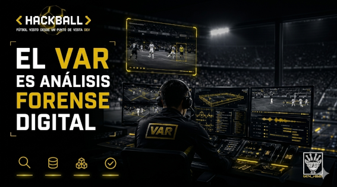

# 05 — El VAR es análisis forense digital

> *"Nadie llama al forense durante el crimen.*  
> *Lo llaman después. Para entender qué pasó.*  
> *El VAR funciona igual."*  
> — t474_r0b07
---

---

Después de un incidente, un investigador hace cuatro cosas:

```
1. recopila evidencia
2. revisa registros
3. reconstruye eventos
4. verifica hipótesis
```

En fútbol lo llaman VAR.  
En ciberseguridad lo llaman DFIR.

No es una metáfora.  
Es el mismo proceso con distinto vocabulario.

---

## El pipeline lado a lado

```
DFIR                              VAR
─────────────────────────────────────────────────────────

DETECCIÓN                         ALERTA
El SIEM dispara una alerta.       El árbitro marca la jugada
Algo anómalo ocurrió.             como revisable.

PRESERVACIÓN                      CONGELAMIENTO
Se hace una imagen forense —      Las cámaras tienen el
copia bit a bit del sistema.      video. Nadie puede
El original no se toca.           modificarlo.

RECOLECCIÓN                       ADQUISICIÓN
Logs, memory dumps,               Ángulos de cámara,
artefactos de red,                datos de tracking,
filesystem artifacts.             telemetría del balón.

ANÁLISIS                          REVISIÓN
Timeline reconstruction.          El VAR revisa frame
¿Qué pasó, cuándo,                a frame. Identifica
en qué orden?                     el momento exacto.

VERIFICACIÓN                      DECISIÓN
¿La evidencia soporta             ¿La jugada infringe
la hipótesis?                     el reglamento?
¿Hay falsos positivos?            ¿Hay duda razonable?

REPORTE                           COMUNICACIÓN
Informe al stakeholder.           El árbitro recibe
Documentación de la cadena        la conclusión y
de custodia.                      toma la decisión final.
```

Cada fase tiene su equivalente.  
Cada problema también.

---

## Los problemas que comparten

**Volatilidad de la evidencia.**

En DFIR, la RAM es evidencia volátil — si el sistema se apaga, desaparece.  
Tienes que capturarla primero, antes que nada.

En el VAR, la jugada en tiempo real es volátil — existe en la memoria de quien la vio.  
El video la congela. Sin el video, solo quedan percepciones subjetivas.

```python
# Principio de preservación — idéntico en ambos contextos:

# DFIR:
def preservar_evidencia(sistema_comprometido):
    imagen = crear_copia_forense(sistema_comprometido)
    hash_md5 = calcular_hash(imagen)
    # ahora puedes analizar sin contaminar el original
    return imagen, hash_md5

# VAR:
def preservar_jugada(timestamp_alerta):
    video = obtener_feeds_camaras(timestamp_alerta)
    # el video es inmutable — nadie puede editarlo
    # el análisis se hace sobre esa copia
    return video
```

**Cadena de custodia.**

En DFIR, cada mano que toca la evidencia se documenta.  
Si la cadena se rompe, la evidencia pierde validez legal.

En el VAR, cada decisión tiene un trail:  
qué cámara, qué frame, qué dato del sensor, qué árbitro revisó, en qué orden.  
Si hay una apelación, existe el registro completo.

**Falsos positivos.**

En DFIR, una alerta no significa compromiso.  
El analista verifica antes de actuar. Escalar demasiado rápido tiene consecuencias.

En el VAR, una alerta del SAOT no significa infracción automática.  
El VAR verifica. El árbitro decide. El sistema no tiene la última palabra.

> `// los sistemas automatizados alertan.`  
> `// los humanos deciden.`  
> `// al menos por ahora.`

---

## La diferencia que importa

Hay una diferencia entre DFIR y VAR que vale la pena nombrar.

En DFIR, el objetivo del análisis es **atribución y remediación**:  
¿quién lo hizo? ¿cómo entró? ¿qué dejó? ¿cómo lo cerramos?

En el VAR, el objetivo es **binario**:  
¿hubo infracción? sí o no.

Eso hace al VAR más simple en su pregunta final —  
pero no en el proceso para llegar a ella.

Y hay algo más:

En DFIR, la investigación ocurre **después** del incidente.  
Nadie detiene la producción mientras el forense trabaja.

En el VAR, la investigación ocurre **dentro** del partido.  
El juego se pausa. 80,000 personas esperan.  
El tiempo de respuesta no es solo técnico — es político.

Por eso el SAOT redujo el tiempo promedio de decisión de 70 segundos a 23.  
No solo porque sea más preciso.  
Sino porque 70 segundos de silencio en un estadio lleno  
es una crisis de percepción pública que ninguna institución quiere repetir.

```
tiempo_decision_var_manual  = 70   # segundos — promedio pre-SAOT
tiempo_decision_var_saot    = 23   # segundos — promedio post-SAOT
reduccion                   = (70 - 23) / 70 * 100

print(f"Reducción: {reduccion:.0f}%")
# Reducción: 67%

# 47 segundos menos de silencio incómodo por decisión.
# Multiplicado por cada revisión en un torneo de 64 partidos.
# No es trivial.
```

---

## Lo que el VAR no puede hacer

Aquí está el límite que ningún sistema técnico ha cruzado todavía.

DFIR puede reconstruir **qué** pasó.  
No puede determinar **por qué** alguien lo hizo.

El VAR puede determinar **si** hubo contacto.  
No puede determinar **si** fue intencional.

```
AUTOMATIZABLE:
- posición del cuerpo          ✓
- momento del contacto         ✓
- trayectoria del balón        ✓
- velocidad del impacto        ✓

NO AUTOMATIZABLE:
- intención                    ✗
- conciencia de la acción      ✗
- contexto del movimiento      ✗
- dolo vs negligencia          ✗
```

Esa columna de la derecha es donde vive el arbitraje humano.  
Y es exactamente donde vive también el análisis forense real —  
porque atribuir intención a un actor de amenaza, con solo logs y artefactos,  
es una habilidad que no se aprende en un tutorial.

> `// la diferencia entre un buen analista y un gran analista`  
> `// no está en las herramientas.`  
> `// está en lo que puede inferir cuando los logs no dicen todo.`

---

## Challenge embebido

```
En un partido con VAR, se revisaron 4 jugadas.
Los tiempos de revisión fueron:
  - Jugada 1: 18 segundos  (SAOT automático)
  - Jugada 2: 94 segundos  (revisión manual, penalti dudoso)
  - Jugada 3: 21 segundos  (SAOT automático)
  - Jugada 4: 67 segundos  (revisión manual, expulsión)

Preguntas:
1. ¿Cuál fue el tiempo promedio total de revisión?
2. ¿Cuál fue el tiempo promedio solo para revisiones SAOT?
3. ¿Cuál fue el tiempo promedio solo para revisiones manuales?
4. ¿Qué dice esa diferencia sobre dónde el sistema todavía falla?

La pregunta 4 no tiene respuesta numérica.
Esa es la parte que importa.

Respuesta → issues del repo · título: [HACKBALL-05]
```

---

<details>
<summary><code>// referencias técnicas</code></summary>

- DFIR methodology — NIST IR 8428
- DFIR phases — Fortinet, Rapid7, SentinelOne (2025)
- VAR decision time reduction — ESPN, InfoTech Sports
- SAOT accuracy — FIFA Club World Cup 2025 data
- Chain of custody — SWGDE Best Practices for Digital Evidence

</details>

---

<details>
<summary><code>// lore relacionado</code></summary>

**El primer caso documentado de evidencia digital fue en 1986.**

Cliff Stoll — astrónomo del Lawrence Berkeley National Laboratory —  
detectó un error de contabilidad de **75 centavos** en los registros de uso del sistema.

Decidió investigarlo.

Lo que encontró fue un hacker alemán llamado Markus Hess infiltrando sistemas militares de Estados Unidos  
y vendiendo información a la KGB soviética.

Stoll no era investigador de seguridad.  
No tenía herramientas forenses. No existían.  
Usó impresoras de papel térmico para registrar cada conexión en tiempo real.

Ese papel térmico fue la primera cadena de custodia digital de la historia.

Stoll documentó todo en su libro *The Cuckoo's Egg* (1989).  
Es lectura obligatoria.

El VAR tiene herramientas que Stoll no podía imaginar.  
Pero el principio es el mismo que él inventó con papel de impresora:

**registra todo.**  
**no toques el original.**  
**sigue el trail.**

</details>

---

*← [04 — La cámara del árbitro](04_camara_arbitro.md) · siguiente → [06 — ¿Puede hackearse un estadio?](06_hackear_estadio.md)*

---

> *t474_r0b07 · [github.com/t474-r0b07](https://github.com/t474-r0b07)*  
> `// construyo sistemas pensando en cómo romperlos.`
