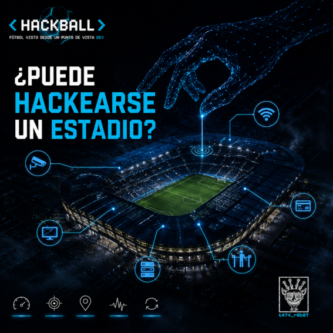

# 06 — ¿Puede hackearse un estadio?

> *"No preguntes si puede hackearse.*  
> *Pregunta qué pasa cuando ya lo hicieron."*  
> — t474_r0b07
---

---

Pregunta interesante.

Pero la respuesta correcta no es sí o no.  
Es: **ya pasó.**

Más de una vez.  
En eventos más grandes que cualquier partido de fútbol.

---

## El inventario

Antes de hablar de ataques, hay que entender qué hay adentro.

Un estadio moderno no es un edificio.  
Es una red.

```
SUPERFICIE DE ATAQUE — ESTADIO MODERNO
─────────────────────────────────────────────────────────

CÁMARAS IP          → decenas. a veces cientos.
                      firmware desactualizado por defecto.
                      credenciales de fábrica sin cambiar.
                      acceso remoto habilitado.

WIFI PÚBLICO        → miles de dispositivos conectados.
                      un punto de acceso falso es indetectable
                      para el 99% de los asistentes.

PANTALLAS DIGITALES → marcadores, publicidad, información.
                      controladas por red interna.
                      en algunos estadios, misma red que seguridad.

TORNIQUETES         → acceso físico controlado por software.
                      integrado con sistema de tickets.
                      si falla el sistema, falla el ingreso.

SISTEMAS DE PAGO    → POS de comida, merchandising, estacionamiento.
                      datos de tarjeta en tránsito.
                      proveedores terceros con acceso a la red.

ILUMINACIÓN         → sistemas SCADA para las torres de luz.
                      algunos con acceso remoto para mantenimiento.
                      protocolo industrial, no diseñado con seguridad en mente.

COMUNICACIONES      → radios digitales del personal de seguridad.
                      sistema de PA (anuncios por altavoz).
                      coordinación con policía y emergencias.
```

El NCSC del Reino Unido auditó organizaciones deportivas y encontró que el **56% de los sistemas CCTV, pagos y torniquetes** tenían acceso remoto habilitado para terceros.

No como vulnerabilidad.  
Como feature.

> `// el mayor riesgo no siempre es el atacante externo.`  
> `// a veces es el técnico de mantenimiento con credenciales compartidas.`

---

## Los casos reales

### Inglaterra, 2020 — Ransomware en un club de fútbol

Un club de la Premier League sufrió un ataque de ransomware que cifró casi todos sus dispositivos.

Resultado:
- Cámaras de seguridad: **fuera de servicio**
- Torniquetes de acceso: **fuera de servicio**
- Sistema de email corporativo: **fuera de servicio**
- El partido casi se cancela

El vector de entrada: **credenciales comprometidas de un proveedor externo**.

No hackearon el estadio directamente.  
Hackearon a alguien que tenía acceso al estadio.

```
ATACANTE → proveedor_externo → VPN → red_interna → ransomware → ??
```

Eso se llama **supply chain attack**.  
Y es la razón por la que el perímetro de seguridad no termina en tus propios sistemas.

---

### Pyeongchang 2018 — Olympic Destroyer

Juegos Olímpicos de Invierno. Ceremonia de apertura.  
Actores de amenaza estatales desplegaron el malware **Olympic Destroyer**.

Resultado en tiempo real:
- Sitio web oficial: **caído**
- WiFi del estadio: **caído**
- Miles de personas no podían imprimir sus tickets para la ceremonia

El malware fue diseñado para parecer obra de Corea del Norte.  
El análisis forense posterior determinó que era obra de **APT28** — inteligencia militar rusa —  
en represalia por la prohibición de Rusia en esos juegos.

Falsa bandera en un ciberataque a un evento deportivo.

> `// atribución en ciberseguridad es difícil.`  
> `// atribución cuando el atacante quiere que lo confundas con otro — es otro nivel.`

---

### Mundial 2026 — la superficie de ataque más grande de la historia

El Mundial 2026 no es un evento. Son **16 ciudades, 3 países, 4 zonas horarias**.

Cada ciudad contrata independientemente:
- operaciones del estadio
- seguridad
- transporte
- conectividad de red
- señalización digital
- producción de fan zones

Eso significa que la superficie de ataque no es un estadio.  
Son 16 estadios con 16 cadenas de proveedores distintas,  
cada una con sus propias vulnerabilidades,  
sin un estándar de seguridad unificado entre ellas.

Cada partido opera una red en capas injertada sobre el ambiente permanente del estadio, que depende de un ecosistema temporal de proveedores comerciales y servicios públicos de la ciudad anfitriona que FIFA no controla.

El precedente de Pyeongchang es la advertencia explícita:  
actores de amenaza rusos hackearon la infraestructura olímpica durante la ceremonia de apertura para interrumpir el desarrollo del evento, derribando el sitio web oficial y el WiFi del estadio.

---

## Cómo piensa un red teamer frente a un estadio

No empieza por las cámaras.  
No empieza por el WiFi.  
Empieza por el **mapa de confianza**.

```python
# Preguntas que hace un red teamer antes de tocar nada:

preguntas = [
    "¿Qué sistemas tienen acceso a qué otros sistemas?",
    "¿Qué proveedores externos tienen credenciales activas?",
    "¿Cuándo fue la última rotación de contraseñas?",
    "¿Qué pasa si este sistema falla? ¿Qué arrastra?",
    "¿Hay segmentación de red entre CCTV y sistemas de pago?",
    "¿El sistema de PA está en la misma red que los torniquetes?",
    "¿Quién tiene acceso remoto y desde dónde?",
]

# La respuesta más peligrosa a cualquiera de estas preguntas:
respuesta_peligrosa = "no lo sé"

# La segunda más peligrosa:
respuesta_peligrosa_2 = "nadie debería poder acceder a eso"
```

El objetivo no es encontrar una vulnerabilidad.  
Es encontrar el **camino de menor resistencia** entre el exterior y el activo más crítico.

En un estadio, ese activo más crítico no es la información.  
Es el **control físico** — torniquetes, iluminación, comunicaciones de emergencia.

---

## La pregunta que nadie hace

Todo el mundo pregunta: *¿puede hackearse un estadio?*

La pregunta correcta es: **¿qué pasa con 80,000 personas adentro cuando lo hacen?**

Un sistema de pago caído es un inconveniente.  
Un sistema de comunicaciones de emergencia caído durante un incidente  
es otra conversación.

> `// la infraestructura crítica no se define por su valor económico.`  
> `// se define por lo que pasa cuando deja de funcionar.`
---
## El otro lado

El red teamer pregunta: *¿cuál es el camino de menor resistencia?*  
El blue teamer pregunta: *¿cómo hago que todos los caminos sean costosos?*

No es defensa reactiva.  
Es diseño ofensivo al revés.

El red teamer busca el hueco.  
El blue teamer asume que el hueco existe  
y construye para cuando lo encuentren.

No *si* lo encuentran.  
*Cuando.*

> `// la diferencia entre los dos no es el objetivo.`  
> `// es el turno.`
---

## Challenge embebido

```
Un estadio tiene la siguiente arquitectura de red:

  [INTERNET]
       |
  [FIREWALL PERIMETRAL]
       |
  [RED CORPORATIVA] ←→ [RED DE SEGURIDAD (CCTV + torniquetes)]
       |
  [RED DE VISITANTES (WiFi público)] ←→ [RED POS (pagos)]

Vulnerabilidades conocidas:
- El WiFi público no está segmentado de la red POS
- Un proveedor externo tiene VPN activa a la red corporativa
- Las cámaras IP usan credenciales de fábrica (admin/admin)
- La red de seguridad y la red corporativa comparten un switch

Preguntas:
1. ¿Cuál es el camino de menor resistencia desde internet
   hasta el sistema de torniquetes?
2. ¿Qué activo atacarías primero y por qué?
3. ¿Qué una sola medida eliminaría más vectores simultáneamente?

No hay una sola respuesta correcta.
Hay respuestas mejor argumentadas que otras.

Respuesta → issues del repo · título: [HACKBALL-06]
```

---

<details>
<summary><code>// referencias técnicas</code></summary>

- NCSC UK Sports Cyber Threat — 56% remote access finding, 2020
- Olympic Destroyer analysis — Recorded Future / Kaspersky, 2018
- English football club ransomware — NCSC UK, 2020
- Ticketmaster breach 2024 — 1.6TB stolen via third-party vendor
- FIFA World Cup 2026 attack surface — Unit 42, Palo Alto Networks, 2026
- OT & IoT Cybersecurity for Stadiums & Arenas — ICS-CERT

</details>

---

<details>
<summary><code>// lore relacionado</code></summary>

**Olympic Destroyer tenía una firma falsa.**

El malware incluía fragmentos de código copiados de herramientas conocidas de Lazarus Group — el grupo APT atribuido a Corea del Norte.

No para usarlos. Para que los analistas forenses los encontraran.

Era una pista falsa deliberadamente plantada dentro del malware.

Kaspersky lo llamó **"la operación de falsa bandera más sofisticada que habíamos visto"**.

El análisis final que atribuyó el ataque a APT28 ruso no se basó en el código.  
Se basó en infraestructura — servidores, dominios, patrones de operación.

Eso es lo que significa hacer forense de verdad:  
no creer lo que el artefacto quiere que creas.  
Buscar lo que no puede mentir.

</details>

---

*← [05 — El VAR es análisis forense digital](05_var_forense.md) · siguiente → [07 — Las apuestas son datos](07_apuestas_datos.md)*

---

> *t474_r0b07 · [github.com/t474-r0b07](https://github.com/t474-r0b07)*  
> `// construyo sistemas pensando en cómo romperlos.`
