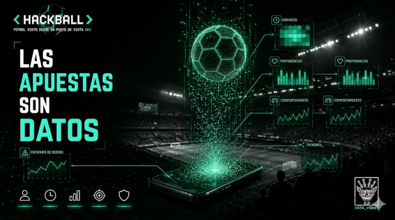

# 07 — Las apuestas son datos

> *"No te están vendiendo la posibilidad de ganar.*  
> *Te están comprando la posibilidad de conocerte."*  
> — t474_r0b07
---

---

Cada vez que apuestas, generas un registro.

No solo el monto.  
No solo el resultado.

```
timestamp           → cuándo apostaste
evento              → qué partido, qué mercado
monto               → cuánto
secuencia           → qué apostaste antes y qué después
resultado           → ganaste o perdiste
tiempo_de_reacción  → cuánto tardaste en apostar tras el gol
dispositivo         → móvil, desktop, app nativa
ubicación           → desde dónde
frecuencia          → cada cuánto vuelves
patron_de_pérdida   → cómo te comportas cuando pierdes
```

Eso no es un ticket de apuesta.  
Es un **perfil de comportamiento**.

Y ese perfil vale más que lo que apostaste.

---

## El negocio real

La industria de apuestas deportivas generó **$95 mil millones** en 2024.  
Se proyecta que llegue a **$182 mil millones** para 2030.

El modelo de negocio superficial es simple: la casa siempre gana.  
El margen está en los odds — el precio está calculado para que el operador gane a largo plazo.

Pero hay un segundo modelo de negocio que no aparece en los titulares:

**Los datos.**

Cada plataforma de apuestas es, técnicamente, una empresa de análisis de comportamiento humano que usa el fútbol como pretexto para recopilar datos.

```python
# Lo que el usuario cree que está haciendo:
accion_usuario = "apostar $10 al partido"

# Lo que la plataforma está haciendo:
accion_plataforma = {
    "registrar": accion_usuario,
    "actualizar_perfil": usuario.behavioral_profile,
    "ajustar": usuario.risk_score,
    "recalcular": usuario.lifetime_value,
    "optimizar": siguiente_oferta_personalizada,
    "detectar": patron_de_vulnerabilidad,
}
```

---

## Cómo funciona el perfil

Las plataformas usan **machine learning** para construir perfiles en tiempo real.

Tres modelos principales:

### 1. Segmentación por comportamiento

Algoritmos de clustering — generalmente **K-Means** o **DBSCAN** — agrupan usuarios con patrones similares:

```python
# Features típicas para clustering de apostadores:
features = [
    'avg_bet_size',           # tamaño promedio de apuesta
    'bet_frequency_per_week', # frecuencia semanal
    'live_bet_ratio',         # % de apuestas en vivo vs previas
    'loss_chase_score',       # tendencia a apostar más tras perder
    'session_duration_avg',   # tiempo promedio por sesión
    'deposit_frequency',      # con qué frecuencia deposita
    'withdrawal_frequency',   # con qué frecuencia retira
    'reaction_time_to_goals', # velocidad de respuesta a eventos
]

# El cluster al que perteneces determina
# qué ofertas ves, qué notificaciones recibes,
# qué límites te sugieren (o no te sugieren).
```

### 2. Detección de patrones de riesgo

El mismo modelo que detecta ludopatía en desarrollo  
es el que optimiza la retención de usuarios rentables.

No es contradicción. Es el mismo algoritmo con dos objetivos distintos según quién lo usa.

```python
# Señales de alerta temprana — patrón de pérdida compulsiva:
risk_indicators = {
    'chasing_losses':     True,   # aumenta apuesta después de perder
    'session_escalation': True,   # sesiones más largas con el tiempo
    'deposit_spike':      True,   # depósito repentino e inusual
    'odd_hours_activity': True,   # actividad a las 3am
    'withdrawal_attempts': 0,     # deposita pero no retira
}

# Si risk_score > threshold:
#   opción A (regulación): intervención automática, mensaje de ayuda
#   opción B (retención):  oferta personalizada, bono de recarga
#
# Cuál activa la plataforma depende de sus incentivos.
# No de los tuyos.
```

### 3. Predicción de lifetime value

El modelo más valioso para la industria:  
predecir cuánto va a gastar un usuario **antes** de que lo gaste.

Con esa predicción, la plataforma decide cuánto invertir en adquirirte, retenerte y reactivarte si te vas.

---

## El dato que incomoda

Los mismos algoritmos que las plataformas declaran usar para *proteger* a usuarios vulnerables  
son los que identifican exactamente **cuándo un usuario está en su punto de mayor vulnerabilidad**.

Esa información puede usarse para intervenir.  
O puede usarse para ofrecer un bono de recarga en el momento exacto.

Un paper de 2024 lo dice sin rodeos:  
*"la industria utiliza soluciones de machine learning industrial para apoyar prácticas de retención,  
y el uso de dark patterns ha demostrado efectos significativos en la manipulación del consumidor."*

Dark patterns en una plataforma de apuestas no son un botón de cierre escondido.  
Son un algoritmo que sabe que estás a punto de irte  
y te manda una notificación push en el momento exacto.

> `// la diferencia entre protección y explotación`  
> `// no está en el dato.`  
> `// está en qué decide hacer el sistema con él.`

---

## La conexión con seguridad

El perfil de comportamiento de un apostador y el perfil de comportamiento de un usuario en una red corporativa tienen más en común de lo que parece.

**UEBA** — *User and Entity Behavior Analytics* — es exactamente esto aplicado a ciberseguridad:

```
APUESTAS                          UEBA / CIBERSEGURIDAD
──────────────────────────────────────────────────────────

Baseline de comportamiento        Baseline de acceso normal
normal del usuario                del usuario en la red

Desviación del baseline →         Desviación del baseline →
oferta personalizada              alerta de seguridad

Clustering de perfiles →          Clustering de comportamiento →
segmentación de usuarios          detección de amenazas internas

Predicción de churn →             Predicción de exfiltración →
campaña de retención              respuesta de incidente
```

El apostador que empieza a apostar a horas inusuales, en montos inusuales, con frecuencia inusual —  
y el empleado que empieza a acceder a archivos inusuales, a horas inusuales, en volúmenes inusuales —

son el mismo problema matemático.

Un sistema entrenado para detectar uno  
puede entrenarse para detectar el otro.

---

## Lo que nadie te dice cuando te registras

Al crear una cuenta en una plataforma de apuestas aceptas, entre otras cosas:

- que tus datos de comportamiento sean procesados por sistemas automatizados
- que esos datos puedan compartirse con terceros para "mejora del servicio"
- que el sistema pueda tomar decisiones automatizadas sobre tu cuenta

En la mayoría de jurisdicciones, ese consentimiento está enterrado en términos y condiciones  
que el 99% de los usuarios no lee.

No es un secreto.  
Es información pública que nadie revisa.

> `// los sistemas más efectivos de recopilación de datos`  
> `// no se llaman vigilancia.`  
> `// se llaman términos y condiciones.`

---

## Challenge embebido

```
Una plataforma registra los siguientes eventos de un usuario
en una sesión de 40 minutos:

t=00:00  depósito: $50
t=00:03  apuesta: $10  resultado: pérdida
t=00:05  apuesta: $20  resultado: pérdida
t=00:09  apuesta: $40  resultado: pérdida
t=00:12  depósito: $100
t=00:14  apuesta: $50  resultado: ganancia ($95)
t=00:18  apuesta: $80  resultado: pérdida
t=00:22  apuesta: $95  resultado: pérdida
t=00:28  depósito: $200
t=00:31  apuesta: $150 resultado: pérdida
t=00:38  apuesta: $200 resultado: pérdida

Preguntas:
1. ¿Cuánto depositó en total? ¿Cuánto perdió neto?
2. ¿Qué patrón de comportamiento identificas?
3. ¿En qué timestamp exacto intervendrías si fueras
   el sistema de detección de riesgo?
4. ¿En qué timestamp exacto intervendrías si fueras
   el sistema de retención de la plataforma?

La diferencia entre las respuestas 3 y 4
es la diferencia entre ética e incentivo.

Respuesta → issues del repo · título: [HACKBALL-07]
```

---

<details>
<summary><code>// referencias técnicas</code></summary>

- Sports betting market — $95B en 2024, proyección $182B 2030
- ML en detección de ludopatía — PMC / NIH, 2024
- Dark patterns en plataformas de apuestas — Newall et al., 2020
- UEBA framework — Gartner, 2023
- Behavioral biometrics en apuestas — Software Mind, 2026
- K-Means clustering aplicado a perfiles de apostadores — ResearchGate, 2024

</details>

---

<details>
<summary><code>// lore relacionado</code></summary>

**Cambridge Analytica no inventó nada nuevo.**

Lo que hizo en 2016 — construir perfiles psicológicos a partir de comportamiento digital para influir decisiones —  
es exactamente lo que la industria de apuestas lleva haciendo desde que existen apps móviles.

La diferencia es el objetivo declarado.

Cambridge Analytica usaba los perfiles para influir votos.  
Las plataformas de apuestas los usan para influir apuestas.

El modelo matemático es el mismo.  
**OCEAN** — Openness, Conscientiousness, Extraversion, Agreeableness, Neuroticism —  
el modelo de personalidad de cinco factores que usó Cambridge Analytica  
tiene correlaciones documentadas con patrones de comportamiento en apuestas.

Neuroticism alto — tendencia a la ansiedad y la impulsividad —  
es uno de los predictores más fuertes de ludopatía.

Y es exactamente el perfil que un sistema de retención quiere identificar primero.

</details>

---

*← [06 — ¿Puede hackearse un estadio?](06_hackear_estadio.md) · siguiente → [08 — ¿Cuántas cámaras te observan durante un partido?](08_camaras_vigilancia.md)*

---

> *t474_r0b07 · [github.com/t474-r0b07](https://github.com/t474-r0b07)*  
> `// construyo sistemas pensando en cómo romperlos.`
