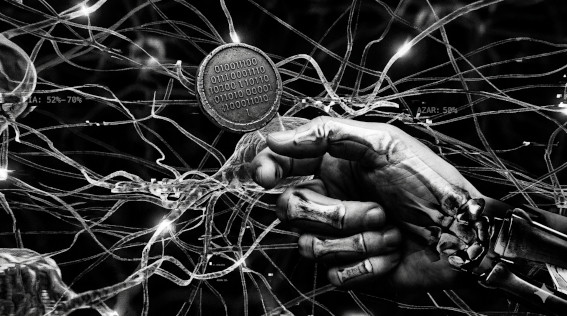

# MITO 01 — "La IA ya predice el resultado exacto de los partidos"

> *"La diferencia entre el modelo más sofisticado y el azar*  
> *cabe en el lanzamiento de una moneda."*  
> — t474_r0b07
---

---

⚡ FALSO

El mejor modelo entrenado con millones de partidos
tiene entre 52% y 70% de precisión.

Una moneda tiene 50%.

Veinte puntos porcentuales separan
la IA más sofisticada del azar puro.

España ganó la Euro 2024 con 9.3% de probabilidad
según el modelo que puso a Francia como favorita.

La IA no predice el fútbol.
Apostó mejor que tú.
Y aun así perdió.

> `// la incertidumbre no desapareció.`  
> `// solo tiene mejor precio.`

---

*← [índice de mitos](README.md) · siguiente → [MITO 02](02_var_automatico.md)*

> *t474_r0b07 · [github.com/t474-r0b07](https://github.com/t474-r0b07)*  
> `// construyo sistemas pensando en cómo romperlos.`
