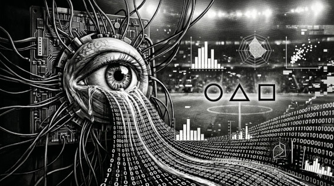

# MITO 03 — "Los ojeadores ya no existen por culpa del Big Data"

> *"El dato encuentra al candidato.*  
> *El ojo humano decide si sirve."*  
> — t474_r0b07
---

---

⚡ FALSO

En 2024 los clubes de élite tienen
más ojeadores que nunca en su historia.

El Big Data no reemplazó al ojeador.
Le dio una lista de 300 jugadores para ir a ver.

Hay cosas que un sensor no mide:
cómo reacciona un jugador cuando pierde.
Cómo habla con sus compañeros.
Si se rinde o no cuando el partido está perdido.

> `// el dato reduce el universo de búsqueda.`  
> `// el criterio humano sigue haciendo la selección final.`

---

*← [MITO 02](02_var_automatico.md) · siguiente → [MITO 04](04_jugadores_ia.md)*

> *t474_r0b07 · [github.com/t474-r0b07](https://github.com/t474-r0b07)*  
> `// construyo sistemas pensando en cómo romperlos.`
