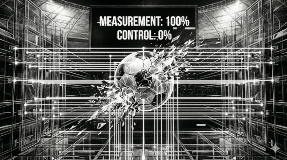

# MITO 05 — "La tecnología eliminó la incertidumbre del fútbol"

> *"Medir algo con precisión no significa controlarlo."*  
> — t474_r0b07
---

---

⚡ ESTE NO ES UN MITO.  
⚡ ES LA ÚNICA CERTEZA DE ESTA LISTA.

Sensores. Algoritmos. Cámaras. Modelos predictivos.
Todo ese arsenal tecnológico
y el fútbol sigue produciendo resultados
que nadie vio venir.

Grecia ganó la Euro 2004.  
Leicester ganó la Premier 2016 con odds de 5000 a 1.  
Marruecos llegó a semifinales del Mundial 2022.

La tecnología hizo el juego más medible.
No más predecible.

> `// la incertidumbre no desapareció.`  
> `// solo la hicimos más visible.`  
> `// y eso la hace más honesta.`

---

*← [MITO 04](04_jugadores_ia.md) · siguiente → [MITO 06](06_portero_estadisticas.md)*

> *t474_r0b07 · [github.com/t474-r0b07](https://github.com/t474-r0b07)*  
> `// construyo sistemas pensando en cómo romperlos.`
