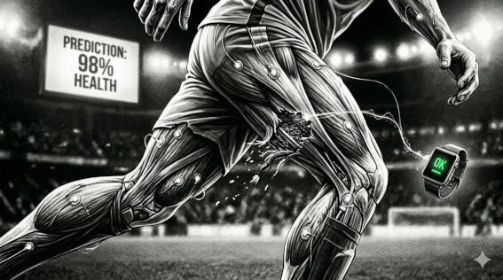

# MITO 07 — "Con GPS y biométricos ya no hay lesiones sorpresa"

> *"Monitorear no es prevenir.*  
> *Es tener mejor documentado lo que igual va a pasar."*  
> — t474_r0b07
---

---

⚡ FALSO

Los sistemas detectan fatiga acumulada,
carga de trabajo, riesgo relativo.

No detectan el sprint en el minuto 87
donde el músculo simplemente dice no.

Erling Haaland tiene sensores.  
Kylian Mbappé tiene sensores.  
Los dos se lesionaron igual.

El sistema predice probabilidades de riesgo.
No puede predecir el instante exacto
en que el cuerpo humano falla.

> `// los datos reducen el riesgo.`  
> `// no eliminan la física.`

---

*← [MITO 06](06_portero_estadisticas.md) · siguiente → [MITO 08](08_offside_1cm.md)*

> *t474_r0b07 · [github.com/t474-r0b07](https://github.com/t474-r0b07)*  
> `// construyo sistemas pensando en cómo romperlos.`
