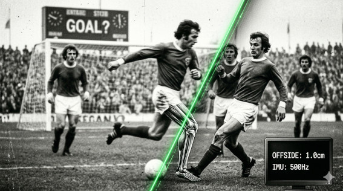

# MITO 08 — "El gol en offside por 1cm es injusto — antes era mejor"

> *"No extrañas la justicia de antes.*  
> *Extrañas la comodidad de no saber."*  
> — t474_r0b07
---

---

⚡ PARCIALMENTE VERDAD. MAYORMENTE NOSTALGIA.

Antes no era mejor.
Antes simplemente no lo veías.

Los offsides por 1cm existían en 1990.
En 2002. En 2010.
Solo que el banderín no tenía 29 keypoints ni IMU de 500Hz.

El árbitro de línea adivinaba.
A veces acertaba. A veces no.
Y nadie lo sabía con certeza.

Ahora lo sabemos.
Y nos parece injusto.

El problema no es la tecnología.
Es que la precisión expone
lo que antes se toleraba por ignorancia.

> `// no extrañas la justicia de antes.`  
> `// extrañas la comodidad de no saber.`

---

*← [MITO 07](07_lesiones_gps.md) · siguiente → [MITO 09](09_futbol_femenino.md)*

> *t474_r0b07 · [github.com/t474-r0b07](https://github.com/t474-r0b07)*  
> `// construyo sistemas pensando en cómo romperlos.`
